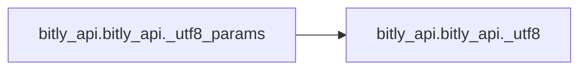

# Bitly Api Bitly Api

[_Documentation generated by Documatic_](https://www.documatic.com)

<!---Documatic-section-Codebase Structure-start--->
## Codebase Structure

<!---Documatic-block-system_architecture-start--->
```mermaid
None
```
<!---Documatic-block-system_architecture-end--->

# #
<!---Documatic-section-Codebase Structure-end--->

<!---Documatic-section-bitly_api.bitly_api._utf8-start--->
## bitly_api.bitly_api._utf8

<!---Documatic-section-_utf8-start--->
<!---Documatic-block-bitly_api.bitly_api._utf8-start--->
<details>
	<summary><code>bitly_api.bitly_api._utf8</code> code snippet</summary>

```python
def _utf8(s):
    if isinstance(s, text_type):
        s = s.encode('utf-8')
    assert isinstance(s, binary_type)
    return s
```
</details>
<!---Documatic-block-bitly_api.bitly_api._utf8-end--->
<!---Documatic-section-_utf8-end--->

# #
<!---Documatic-section-bitly_api.bitly_api._utf8-end--->

<!---Documatic-section-bitly_api.bitly_api._utf8_params-start--->
## bitly_api.bitly_api._utf8_params

<!---Documatic-section-_utf8_params-start--->


### Object Calls

* bitly_api.bitly_api._utf8

<!---Documatic-block-bitly_api.bitly_api._utf8_params-start--->
<details>
	<summary><code>bitly_api.bitly_api._utf8_params</code> code snippet</summary>

```python
def _utf8_params(params):
    assert isinstance(params, dict)
    encoded_params = []
    for (k, v) in params.items():
        if v is None:
            continue
        if isinstance(v, numeric_types):
            v = str(v)
        if isinstance(v, (list, tuple)):
            v = [_utf8(x) for x in v]
        else:
            v = _utf8(v)
        encoded_params.append((k, v))
    return dict(encoded_params)
```
</details>
<!---Documatic-block-bitly_api.bitly_api._utf8_params-end--->
<!---Documatic-section-_utf8_params-end--->

# #
<!---Documatic-section-bitly_api.bitly_api._utf8_params-end--->

[_Documentation generated by Documatic_](https://www.documatic.com)